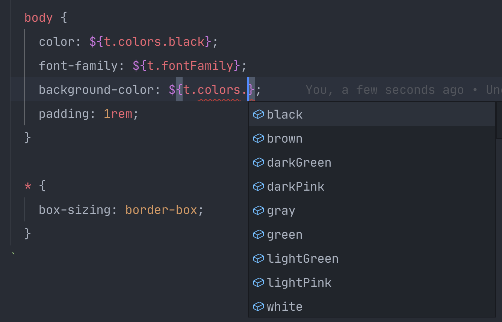

# 

**Instead of writing a function to reference a theme prop:**
```ts
styled.button`
  color: ${props => props.theme.colors.primary};
`
```
**... use a _`shorted-theme`_ reference:**
```ts
styled.button`
  color: ${t.colors.primary};
`
```

<br><br><br>

## Features
 - Zero dependencies.
 - [TypeScript support](#typescript-support).
 - Write less characters.
 - Tests with 100% coverage.

## Installation
```bash
npm i shorted-theme
```

## Usage
```ts
import styled from 'styled-components'
import shorted from 'shorted-theme'

const theme = {
  colors: {
    primary: 'red',
    secondary: 'blue',
  },
  fontFamily: '"Roboto", sans-serif',
  fontSizes: {
    small: 12,
    regular: 14,
    large: 18,
  }
}

const t = shorted(theme) // 👈 short your theme then use everywhere.

const Button = styled.button`
  color: ${t.colors.primary};
  color: ${t.colors.primary};
  font-family: ${t.fontFamily};
  font-size: ${t.fontSizes.regular};
`
```

## TypeScript Support
`shorted-theme` use all your typings.



### Suggestion

You can destructure the shorted theme object. That way you can reference direct children properties instead of a root object.
```ts
const { colors, fontFamily, fontSizes } = shorted(theme)

const Button = styled.button`
  color: ${colors.primary};
  color: ${colors.primary};
  font-family: ${fontFamily};
  font-size: ${fontSizes.regular};
`
```

## Limitations
`shorted-theme` is useful for writing less when referencing theme values. However, it can't be used in expressions. For example:

```ts
// THIS WILL NOT WORK
const Button = styled.button`
  padding: ${t.padding.default * 10}
`
```
Instead you should use the function expression:
```ts
const Button = styled.button`
  padding: ${props => props.theme.padding.default * 10}
`
```

## Development

 1. Clone this repository.
 2. Install dependencies: `npm i`.
 3. Run it locally: `npm start` or `./src/bin.js`

### Tests
```sh
npm run test
```

### Releases
Releases are triggered by `npm version` and handled by [GitHub Actions](https://github.com/rmariuzzo/shorted-theme/actions?query=workflow%3Apublish).

<center><br><br><br>

Made with ♥ by [@rmariuzzo](https://github.com/rmariuzzo)

</center>